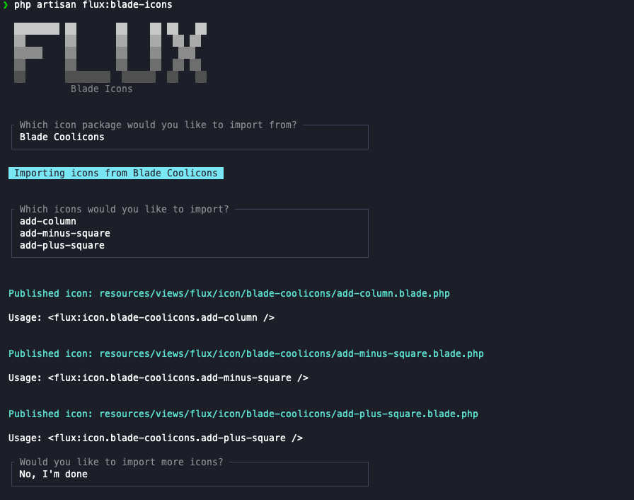

# Flux Blade Icons

`flux-blade-icons` imports SVGs from third-party Blade icon packages and generates Flux-compatible Blade icon views inside your Laravel application.

The package is built for projects that already use Flux and want to reuse the Blade icon ecosystem without manually copying SVG files. It ships with a large registry of supported icon packages, lets you add or override icon sets through configuration, caches remote icon lists for the interactive importer, and writes the generated views to your application so they can be versioned with the rest of your codebase.

## What The Package Does

- Imports icons from supported Blade icon packages.
- Generates local Flux-compatible Blade views under `resources/views/flux/icon` by default.
- Supports both interactive imports and direct command-line imports.
- Caches fetched icon lists to speed up repeated imports.
- Lets you register custom icon sets or override built-in ones.

## Installation

Install the package from Packagist with Composer:

```bash
composer require elemind/flux-blade-icons
```

Laravel package discovery will register the service provider automatically.

## Publish The Configuration

If you want to change the output path, cache TTL, or icon set registry, publish the configuration file:

```bash
php artisan vendor:publish --tag="flux-blade-icons-config"
```

This will create `config/flux-blade-icons.php`.

## Configuration

The published configuration contains four main options:

```php
return [
    'output_path' => resource_path('views/flux/icon'),

    'cache_ttl' => 86400,

    'default_icon_sets' => [
        // Built-in icon sets shipped with the package.
    ],

    'icon_sets' => [
        // Your custom icon sets or overrides.
    ],
];
```

### `output_path`

Defines where generated Flux icon Blade views will be stored.

Default:

```php
resource_path('views/flux/icon')
```

### `cache_ttl`

Defines how long fetched icon lists should remain cached, in seconds.

Default:

```php
86400
```

### `default_icon_sets`

Contains the built-in registry shipped with the package. This includes many Blade icon packages out of the box, such as Heroicons, Feather Icons, Bootstrap Icons, and others.

### `icon_sets`

Use this section to add your own icon sources or override one of the built-in keys without editing the package defaults.

Example:

```php
'icon_sets' => [
    'custom-icons' => [
        'name' => 'Custom Icons',
        'url' => 'https://icons.example.com',
        'svg' => 'https://cdn.example.com/icons/',
    ],
],
```

Each icon set must define:

- `name`: the label shown in the interactive command.
- `url`: the package or documentation URL shown to the user.
- `svg`: the base URL used to fetch individual SVG files.

## Available Commands

The package registers two Artisan commands:

```bash
php artisan flux:blade-icons
php artisan flux:blade-icons:clear-cache
```

## Import Icons

Use `flux:blade-icons` to generate one or more Flux-compatible Blade views from a configured icon set.

### Fully interactive import

Choose the icon package first, then search and select icons interactively:

```bash
php artisan flux:blade-icons
```



### Import a single icon from a specific set

```bash
php artisan flux:blade-icons plus --set=blade-feather-icons
```

### Import multiple icons in one command

```bash
php artisan flux:blade-icons plus minus x --set=blade-feather-icons
```

### Import a nested icon

Some icon packages store icons inside subdirectories. In that case, use the relative icon path:

```bash
php artisan flux:blade-icons outline/arrow-left --set=blade-heroicons
```

### Refresh the remote icon list before importing

Use `--fresh` to bypass the cached icon list:

```bash
php artisan flux:blade-icons --set=blade-heroicons --fresh
```

### Interactive fallback for non-GitHub sources

If an icon set is not hosted on GitHub, or if the GitHub API cannot be reached, the command falls back to manual icon name entry. You can still import icons as long as the configured `svg` URL points to valid SVG files.

## Clear Cached Icon Lists

Use `flux:blade-icons:clear-cache` to remove cached icon lists used by the importer.

### Clear the cache for all registered icon sets

```bash
php artisan flux:blade-icons:clear-cache
```

### Clear the cache for one icon set only

```bash
php artisan flux:blade-icons:clear-cache --set=blade-feather-icons
```

## Generated Component Usage

After importing an icon, the package tells you the component name to use in your Flux views.

If you import:

```bash
php artisan flux:blade-icons plus --set=blade-feather-icons
```

You can use it like this:

```blade
<flux:icon.blade-feather-icons.plus />
```

If you import a nested icon such as:

```bash
php artisan flux:blade-icons outline/arrow-left --set=blade-heroicons
```

You can use it like this:

```blade
<flux:icon.blade-heroicons.outline.arrow-left />
```

## Notes

- Generated icons are stored as local Blade views in your application.
- If an icon already exists, the import command asks whether it should be overwritten.
- The generated templates adapt the imported SVG to Flux icon conventions.

## Testing

```bash
composer test
```

## License

MIT. See [LICENSE.md](LICENSE.md) for details.
